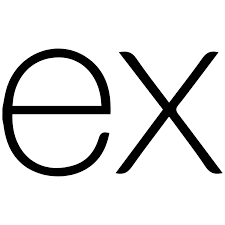

# Welcome to My Portfolio!

This website showcases my background in graphic design, web development, and programming. I’m passionate about continually learning new skills, techniques, and ideas as a developer. I’d love to hear your thoughts and suggestions for improvement!

### <a href="https://portfolio-svkb.onrender.com/" target="_blank">Click Here</a> to view the website!

### This project was created using:

&nbsp;&nbsp;&nbsp;
&nbsp;&nbsp;&nbsp;
&nbsp;&nbsp;&nbsp;
&nbsp;&nbsp;&nbsp;

### Future Improvement Ideas:
- Create an image carousel to showcase my graphic design projects
- Add features that integrate a database to gain hands-on practice
- Prioritize accessible design to improve SEO and ensure usability for all users

### Future Project Ideas:
- Build an Express app where users can create quizzes on their favorite subjects and play quizzes created by others.
- Engage in a website redesign challenge by recreating a popular website using figma
- Have an idea? Send it my way!  
  
#### Have a project idea, job opportunity, or just want to say hi?  

&nbsp;&nbsp;&nbsp;
&nbsp;&nbsp;&nbsp;

Donate to a poor college student? Feel free to buy me some <a href="https://venmo.com/alayna-hart">energy</a>

