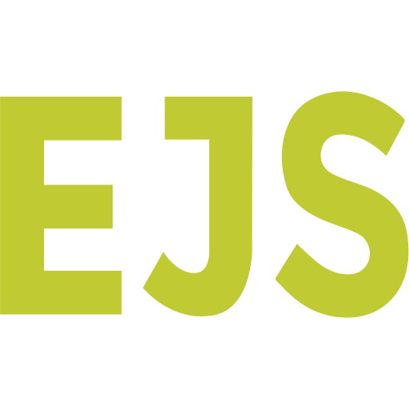

# Welcome to My Portfolio!

This website showcases my background in graphic design, web development, and programming. I’m passionate about continually learning new skills, techniques, and ideas as a developer. I’d love to hear your thoughts and suggestions for improvement!

This project was created using:

&nbsp;&nbsp;&nbsp;
&nbsp;&nbsp;&nbsp;
&nbsp;&nbsp;&nbsp;
&nbsp;&nbsp;&nbsp;

Future Improvement Ideas:
-Create an image carousel to showcase my graphic design projects
-
-

//future project ideas

//future improvements 

## <a href="https://portfolio-svkb.onrender.com/" >Click Here</a> to view the website!

You can reach me here:

//do this

&nbsp;&nbsp;&nbsp;
&nbsp;&nbsp;&nbsp;
&nbsp;&nbsp;&nbsp;
&nbsp;&nbsp;&nbsp;

Donate to a poor college student? Feel free to buy me some <a href="https://venmo.com/alayna-hart">energy</a>

